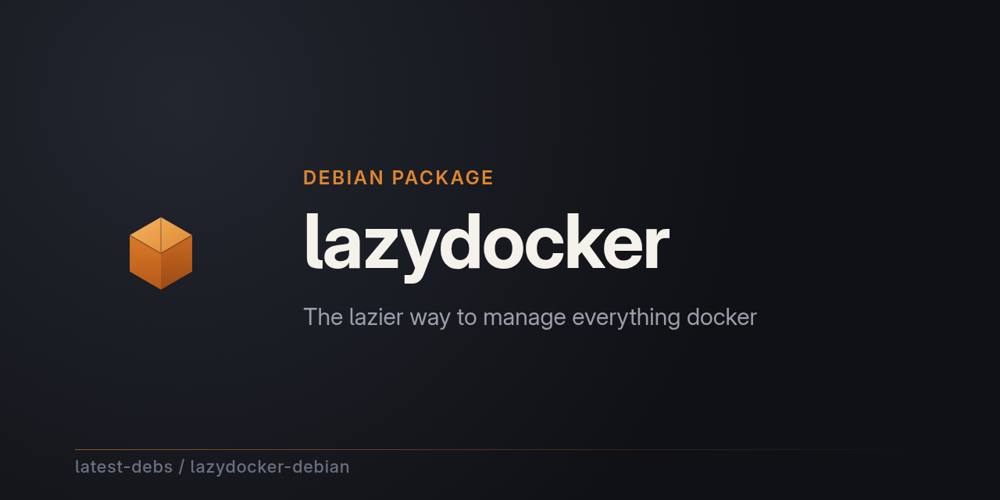

# lazydocker for Debian

[lazydocker](https://github.com/jesseduffield/lazydocker) — the lazier way
to manage everything docker — packaged for Debian as part of
[latest-debs](https://github.com/latest-debs).

## Install

Via the latest-debs apt repository:

```sh
sudo extrepo enable latest-debs
sudo apt update
sudo apt install lazydocker
```

Or download a `.deb` from the [Releases](https://github.com/latest-debs/lazydocker-debian/releases) page:

```sh
sudo dpkg -i lazydocker_*.deb
```

## Supported distributions & architectures

- Debian Bookworm (12), Trixie (13), Forky (14/testing), Sid (unstable)
- amd64, arm64, armhf, i386 (bookworm/trixie)

## Building

Run the [Build lazydocker for Debian](../../actions) workflow on GitHub with
the desired upstream version. Packaging is driven by
[debian-multiarch-builder](https://github.com/ranjithrajv/debian-multiarch-builder).

## Disclaimer

Unofficial packaging only. For issues with lazydocker itself, see
[jesseduffield/lazydocker](https://github.com/jesseduffield/lazydocker).
